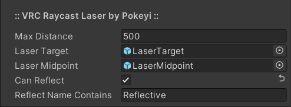

# 🚧 VRC-Raycast-Laser 
Raycast laser renderer and point-plotter for VRChat.

## Overview
🚧 This project is functional but in early stages with additional features planned. 🚧

VRC Raycast Laser is a single configurable UdonSharp behaviour that can be used to raycast a visual line-rendered laser with optional reflective properties and point-plotting for collision-detection objects.

It is intended to be efficient and relatively simple to use without the need for any additional editor scripts or dependencies outside of UdonSharp. All configuration can be done within the Unity Inspector window without the need for any programming, Udon, or SDK knowledge. That said, the source code is cleanly-organized and commented in the hopes of also being a good learning tool.

### Requirements
Errors regarding functions not being exposed likely mean you need an updated version of the SDK or UdonSharp.
- [VRChat Worlds SDK3](https://vrchat.com/home/download) (Tested: v2021.11.8)
- [UdonSharp](https://github.com/MerlinVR/UdonSharp) (Tested: v0.20.3)

### Recommended
Other useful VRChat world-creation tools that I will always recommend.
- [World Creator Assistant](https://github.com/Varneon/WorldCreatorAssistant) (SDK & Package Management)
- [CyanEmu](https://github.com/CyanLaser/CyanEmu) (Unity-Window Testing)
- [Udon Platform Hook](https://github.com/Superbstingray/UdonPlayerPlatformHook) (Moving-Platform Functionality)

### Setup
Make sure you have already imported the VRChat Worlds SDK and UdonSharp into your project.
- Download the latest [Unity Package](https://github.com/Pokeyi/VRC-Raycast-Laser/releases) and import it into your project.
- A pre-configured example prefab is included that you can drop into your scene if you like.
- Create and select an empty game object and add the P_RaycastLaser behaviour via the Unity Inspector window or 'Component > Pokeyi.VRChat > P.VRC Raycast Laser' toolbar menu.
- Click the 'Convert to UdonBehaviour' button if prompted.
- If a line-renderer component is not already on your game object, one will be added automatically. You can adjust the laser's visual properties here. (See: [Unity Docs](https://docs.unity3d.com/Manual/class-LineRenderer.html))
- Configure the rest of the behaviour's properties in the Inspector window as you see fit. Each of these is explained in detail further below.

## Features
The main features of the Raycast Laser.
- Raycast Properties - General settings pertaining to the raycast function.
- Collision Objects - Optional references to game objects that can be plotted to laser endpoint and midpoint for collision detection.
- Reflective Properties - If and how the laser can reflect off of other game objects.

All of the following properties have hover-tooltips in the Unity Inspector window.

### Raycast Properties
General settings pertaining to the raycast function.
- Max Distance - Maximum distance the laser will be rendered when nothing has been hit. I recommend a value of at least 500 to avoid some odd Unity behaviour.

### Collision Objects
If you want players or objects to be effected by your laser, you can add game objects here to be plotted along the laser's path.
- Laser Target - Object to plot at laser endpoint.
- Laser Midpoint - Object to plot at laser midpoint.

### Reflective Properties
If and how the laser can reflect off of other game objects.
- Can Reflect - Toggle ability to bounce on reflective surfaces.
- Reflect Name Contains - Check for partial object name designating a reflective surfaces.

### Use Case Examples
Despite the name you could use this for things other than lasers, and I plan to add more functionality for these.
- Other general forms of weapon targeting without the line renderer.

## Credit & Support
Please credit me as Pokeyi if you use my work. I would also love to see your creations that make use of it if you're inclined to share. This and [related projects](https://github.com/Pokeyi/VRC-Omni-Action) at release have involved over three months of solid work and self-education as I strive for an opportunity to change careers and make a better life for myself. If you find value in my work, please consider supporting me, I appreciate it more than you can imagine!

## License
This work is licensed under the MIT License.

Copyright © 2021 Pokeyi - https://pokeyi.dev - [pokeyi@pm.me](mailto:pokeyi@pm.me)

Permission is hereby granted, free of charge, to any person obtaining a copy
of this software and associated documentation files (the "Software"), to deal
in the Software without restriction, including without limitation the rights
to use, copy, modify, merge, publish, distribute, sublicense, and/or sell
copies of the Software, and to permit persons to whom the Software is
furnished to do so, subject to the following conditions:

The above copyright notice and this permission notice shall be included in all
copies or substantial portions of the Software.

THE SOFTWARE IS PROVIDED "AS IS", WITHOUT WARRANTY OF ANY KIND, EXPRESS OR
IMPLIED, INCLUDING BUT NOT LIMITED TO THE WARRANTIES OF MERCHANTABILITY,
FITNESS FOR A PARTICULAR PURPOSE AND NONINFRINGEMENT. IN NO EVENT SHALL THE
AUTHORS OR COPYRIGHT HOLDERS BE LIABLE FOR ANY CLAIM, DAMAGES OR OTHER
LIABILITY, WHETHER IN AN ACTION OF CONTRACT, TORT OR OTHERWISE, ARISING FROM,
OUT OF OR IN CONNECTION WITH THE SOFTWARE OR THE USE OR OTHER DEALINGS IN THE
SOFTWARE.
